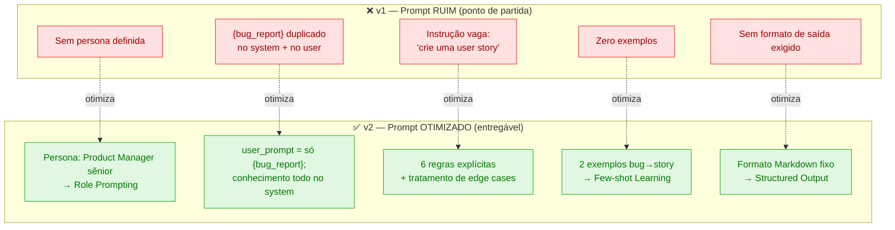
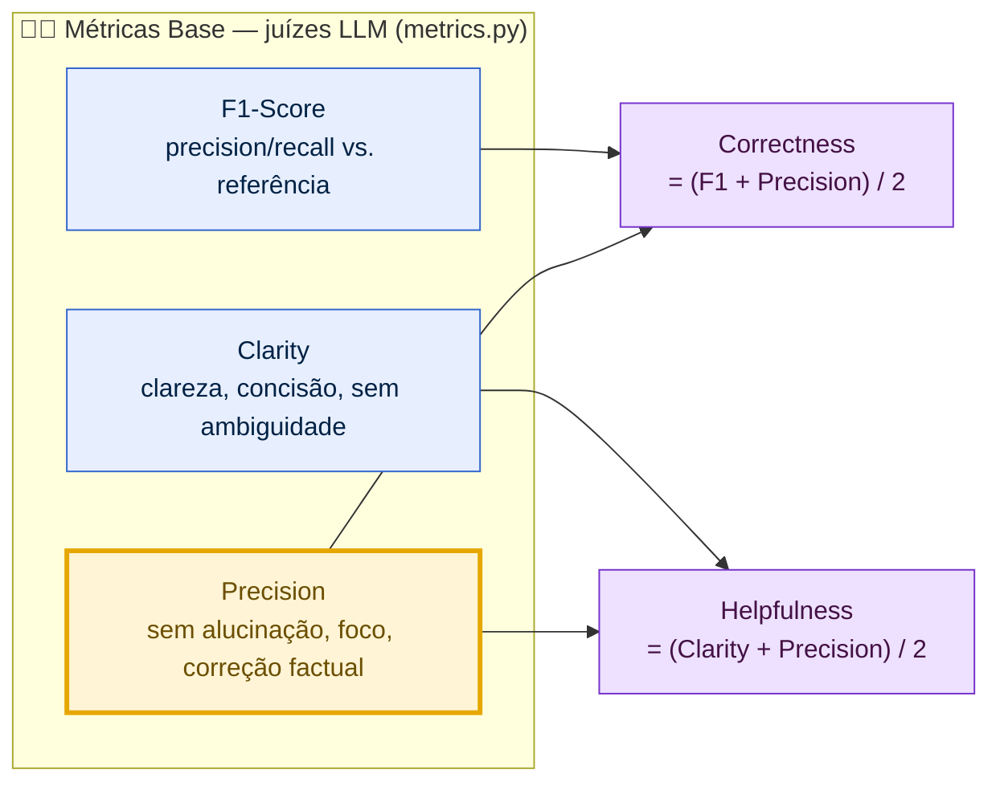

# Pull, Otimização e Avaliação de Prompts com LangChain e LangSmith

Pipeline que puxa um prompt de baixa qualidade do **LangSmith Prompt Hub**, o
refatora com técnicas de Prompt Engineering, republica a versão otimizada de forma
pública e a avalia automaticamente contra 15 cenários reais usando 5 métricas via
**LLM-as-Judge**.

> **Status:** ✅ **APROVADO** — todas as 5 métricas ≥ 0.8 (média geral **0.8277**).
> Prompt otimizado: [`rodrigorjsf/bug_to_user_story_v2`](https://smith.langchain.com/prompts/bug_to_user_story_v2).

O fluxo completo é `pull (v1) → otimizar → push público (v2) → avaliar → iterar`.


---

## Como Executar

### Pré-requisitos

- **Python 3.12** (as dependências fixadas — `pydantic-core`, stack LangChain — ainda
  não têm wheels para 3.13/3.14).
- Conta no [LangSmith](https://smith.langchain.com/) (para o Prompt Hub e o tracing).
- Uma API Key de LLM: **Google Gemini** (free) ou **OpenAI**.

### 1. Ambiente e dependências

```bash
# com uv (recomendado)
uv venv --python 3.12 .venv
uv pip install --python .venv/bin/python -r requirements.txt

# ou com venv padrão
python3.12 -m venv .venv
source .venv/bin/activate
pip install -r requirements.txt
```

### 2. Credenciais (`.env`)

Copie `.env.example` para `.env` e preencha:

```bash
LANGSMITH_API_KEY=...            # sua chave do LangSmith
USERNAME_LANGSMITH_HUB=...       # seu handle no Hub (namespace do push)
LANGSMITH_PROJECT=MBA-evaluation-prompt

# Provider de LLM (escolha um)
LLM_PROVIDER=google              # ou "openai"
GOOGLE_API_KEY=...               # se google
LLM_MODEL=gemini-3.1-flash-lite  # modelo que responde
EVAL_MODEL=gemini-3.1-flash-lite # modelo juiz (avaliação)
```

### 3. Ordem de execução

```bash
# 1. Pull do prompt inicial (v1) do Hub -> prompts/bug_to_user_story_v1.yml
python src/pull_prompts.py

# 2. Refatorar: editar prompts/bug_to_user_story_v2.yml (já otimizado neste repo)

# 3. Push público do v2 -> {USERNAME_LANGSMITH_HUB}/bug_to_user_story_v2
python src/push_prompts.py

# 4. Avaliação end-to-end (puxa o v2 do Hub, roda os 15 exemplos, imprime as métricas)
#    No free tier do Gemini, execute via o wrapper com throttling — MESMA lógica do
#    evaluate.py, só com pacing de RPM (ver "Nota sobre limites de taxa" abaixo):
python evaluate_throttled.py
#    (com cota suficiente, o original imutável roda igual: python src/evaluate.py)
```

### 4. Testes de validação (sem credenciais)

```bash
.venv/bin/python -m pytest -q
```

### Nota sobre limites de taxa (rate limit) e conformidade com o SPEC

O `src/evaluate.py` dispara ~60 chamadas ao LLM por execução (15 exemplos × 1 geração +
3 juízes). Em **cota free** do Gemini, esse burst estoura o limite por minuto do
`gemini-3.1-flash-lite`, recebe `429` e o `evaluate.py` **descarta exemplos silenciosamente**
(resposta vazia → pulada), corrompendo as notas.

> **Conformidade com o SPEC.** Para respeitar o enunciado, **`src/evaluate.py` NÃO foi
> modificado** — permanece exatamente como no boilerplate (arquivo imutável). Foi necessário
> criar [`evaluate_throttled.py`](evaluate_throttled.py), e **foi ele o efetivamente
> executado** para gerar as evidências, devido às políticas atuais do Gemini e à limitação de
> rate limit do modelo usado (`gemini-3.1-flash-lite`, 15 RPM no free tier). A **lógica
> seguida é exatamente a mesma do `evaluate.py` original**: o wrapper apenas injeta um
> `InMemoryRateLimiter` (~14 RPM) em toda instância de `ChatGoogleGenerativeAI` (gerador +
> juízes) e executa o `src/evaluate.py` imutável via `runpy`. Nenhuma métrica, prompt ou
> regra de aprovação é alterada — só o ritmo das chamadas à API.

```bash
# roda o evaluate.py ORIGINAL com pacing de ~14 RPM (zero 429, 15/15 limpos)
python evaluate_throttled.py
```

Alternativa: com cota maior (tier pago ou modelo com RPM mais alto), o original imutável roda
igual — `python src/evaluate.py`.

---

## Técnicas Aplicadas (Fase 2)

O prompt otimizado (`prompts/bug_to_user_story_v2.yml`) combina **três técnicas**
(declaradas em `techniques_applied`). O diagrama abaixo contrasta cada defeito intencional
do v1 com a correção correspondente no v2:



### 1. Role Prompting

O `system_prompt` abre fixando uma persona especialista:

```
Você é um Product Manager sênior especialista em metodologias ágeis e descoberta de produto.
```

**Por quê:** ancorar o modelo no papel de PM faz com que ele traduza o **sintoma técnico**
do bug em uma **necessidade de negócio** do usuário afetado — exatamente o que a User Story
de referência espera — em vez de apenas reescrever o relato do bug.

### 2. Few-shot Learning (obrigatório)

Dois exemplos completos `bug → User Story` embutidos no `system_prompt`, com cenários
**novos** (videoconsulta de telemedicina; cronômetro de quiz em EdTech) que **não** se
sobrepõem aos 15 itens do dataset de avaliação (evita contaminação).

**Por quê:** demonstrar o formato exato exigido —
`Como um… eu quero… para que…` seguido de `Critérios de Aceitação` em
`Dado / Quando / Então` — reduz drasticamente a variância de formato e eleva o **recall**
(F1), porque a resposta passa a cobrir os critérios no mesmo padrão da referência.

### 3. Structured Output Formatting

Regras explícitas exigindo **apenas** a User Story final, sem raciocínio visível
([ADR-0002](docs/adr/0002-output-is-user-story-only.md)):

```
Escreva APENAS a User Story final — sem explicações, sem raciocínio, sem texto introdutório.
```

**Por quê:** os juízes de **Precision** e **Clarity** penalizam alucinação, divagação e
verbosidade. Forçar saída focada e concisa, sem etapas intermediárias, protege essas duas
métricas (e, por consequência, as derivadas Helpfulness e Correctness). O raciocínio (Chain
of Thought) é mantido **interno** ao modelo — aplicado, mas nunca impresso — justamente para
não poluir a saída avaliada.

> O `user_prompt` é exatamente `"{bug_report}"` — a única variável de template; todo o
> conhecimento (persona, regras, exemplos) vive no `system_prompt`.

---

## Resultados Finais

A avaliação oficial do desafio (`src/evaluate.py`) mede **apenas o prompt otimizado v2**
contra os 15 exemplos do dataset — é o único prompt que o SPEC pede para avaliar. O run
abaixo é **real** (`gemini-3.1-flash-lite`, 15/15 exemplos, throttle de 14 RPM), puxando o
v2 do Hub; a saída bruta está versionada em
[`docs/evidence/v2_run.txt`](docs/evidence/v2_run.txt).

### Avaliação real do v2 (entregável)

`rodrigorjsf/bug_to_user_story_v2`:

```
==================================================
Prompt: rodrigorjsf/bug_to_user_story_v2
==================================================

Métricas Derivadas:
- Helpfulness: 0.81 ✓
- Correctness: 0.84 ✓

Métricas Base:
- F1-Score: 0.88 ✓
- Clarity: 0.81 ✓
- Precision: 0.80 ✓

📊 MÉDIA GERAL: 0.8277
✅ STATUS: APROVADO - Todas as métricas >= 0.8
```

### Evidências no LangSmith

- **Projeto / dashboard:** <https://smith.langchain.com/projects/MBA-evaluation-prompt>
- **Prompt v2 público:** <https://smith.langchain.com/prompts/bug_to_user_story_v2>
- **Dataset** `MBA-evaluation-prompt-eval` com os 15 exemplos; tracing visível para todos.
- _Screenshots do dashboard com as notas ≥ 0.8 e os traces de ≥ 3 exemplos: a anexar
  (capturados da conta LangSmith do autor)._

### Jornada de avaliação

O prompt v2 atingiu a aprovação **sem precisar de iteração de conteúdo** — o gargalo não
foi a qualidade do prompt, e sim a **cota de API**. Sequência real:

1. `gemini-2.5-flash` (free, ~5 RPM): só 6/15 exemplos avaliados; o restante caiu em `429`
   e foi descartado, com um juiz F1 zerado por rate-limit → medição corrompida.
2. `gemini-2.0-flash`: cota free `limit: 0` neste projeto → tudo 0.00.
3. `gemini-3.1-flash-lite` sem throttle: avançou para 8/15, ainda com 429.
4. `gemini-3.1-flash-lite` **com throttle de 14 RPM**: **15/15 limpos, zero 429 →
   APROVADO** (média 0.8277).

Lição alinhada ao tracing do LangSmith: distinga uma métrica derrubada a 0.0 por
**rate-limit** de um gap real de qualidade — reexecute com pacing antes de reescrever o
prompt.

---

## Métricas de avaliação

Os juízes (LLM-as-Judge, em `src/metrics.py`) produzem 3 métricas-base e 2 derivadas.
**Precision** é a métrica de maior alavancagem porque alimenta as duas derivadas:



| Métrica | Como é calculada |
|---|---|
| **F1-Score** | média harmônica de precision/recall da resposta vs. a referência |
| **Clarity** | organização, linguagem simples, ausência de ambiguidade, concisão |
| **Precision** | ausência de alucinação, foco na pergunta, correção factual |
| **Helpfulness** | derivada: `(Clarity + Precision) / 2` |
| **Correctness** | derivada: `(F1 + Precision) / 2` |

Aprovação exige **todas as 5 ≥ 0.8** (não apenas a média).

---

## Estrutura do projeto

```
mba-ia-pull-evaluation-prompt/
├── .env.example
├── requirements.txt
├── README.md
├── evaluate_throttled.py          # wrapper: roda o evaluate.py imutável com ~14 RPM
├── prompts/
│   ├── bug_to_user_story_v1.yml   # baseline puxado do Hub
│   └── bug_to_user_story_v2.yml   # prompt otimizado (entregável)
├── datasets/
│   └── bug_to_user_story.jsonl    # 15 bugs (5 simples, 7 médios, 3 complexos)
├── docs/
│   └── evidence/                  # saída bruta da avaliação real do v2
├── src/
│   ├── pull_prompts.py            # pull do Hub          (implementado)
│   ├── push_prompts.py            # push público do Hub  (implementado)
│   ├── evaluate.py                # avaliação            (imutável)
│   ├── metrics.py                 # 5 métricas           (imutável)
│   └── utils.py                   # helpers              (imutável)
└── tests/
    ├── test_prompts.py            # 6 testes de validação do v2
    ├── test_pull.py               # teste do pull (Hub mockado)
    └── test_push.py               # teste do push (Hub mockado)
```

> `src/evaluate.py`, `src/metrics.py`, `src/utils.py` e o dataset são **imutáveis** —
> nunca são editados. Os entregáveis implementados são os scripts de pull/push, o prompt
> v2 e os testes.

---

## Tecnologias

Python 3.12 · LangChain `0.3.13` · LangSmith `0.2.7` · Prompt Hub · pytest · prompts em
YAML · multi-provider (Google Gemini / OpenAI).
