# Pull, Otimização e Avaliação de Prompts com LangChain e LangSmith

Pipeline que puxa um prompt de baixa qualidade do **LangSmith Prompt Hub**, o
refatora com técnicas de Prompt Engineering, republica a versão otimizada de forma
pública e a avalia automaticamente contra 15 cenários reais usando 5 métricas via
**LLM-as-Judge**.

> **Status:** ✅ **APROVADO** — todas as 5 métricas ≥ 0.8 (média geral **0.8394**, Experiment
> `bug_to_user_story_v2-765f0d5e`), sob os modelos do SPEC: geração `gpt-4o-mini`, juiz `gpt-4o`.
> Prompt otimizado: [`rodrigorjsf/bug_to_user_story_v2`](https://smith.langchain.com/hub/rodrigorjsf/bug_to_user_story_v2).

O fluxo completo é `pull (v1) → otimizar → push público (v2) → avaliar → iterar`.

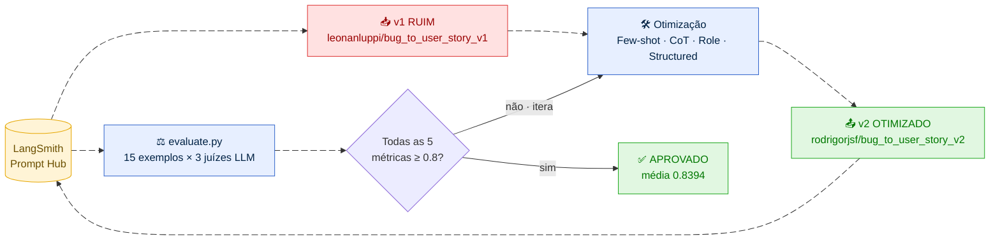

---

## Como Executar

### Pré-requisitos

- **Python 3.12** (as dependências fixadas — `pydantic-core`, stack LangChain — ainda
  não têm wheels para 3.13/3.14).
- Conta no [LangSmith](https://smith.langchain.com/) (para o Prompt Hub e o tracing).
- Uma API Key de LLM: **Google Gemini** (free) ou **OpenAI**.

### 1. Ambiente e dependências

```bash
# com uv (recomendado)
uv venv --python 3.12 .venv
uv pip install --python .venv/bin/python -r requirements.txt

# ou com venv padrão
python3.12 -m venv .venv
source .venv/bin/activate        # fish: source .venv/bin/activate.fish · Windows: .venv\Scripts\activate
pip install -r requirements.txt
```

### 2. Credenciais (`.env`)

Copie `.env.example` para `.env` e preencha. A configuração **oficial do entregável** usa os
modelos do SPEC (OpenAI); o Gemini free fica como alternativa gratuita:

```bash
LANGSMITH_API_KEY=...            # sua chave do LangSmith
USERNAME_LANGSMITH_HUB=...       # seu handle no Hub (namespace do push)
LANGSMITH_PROJECT=mba-projects

# Provider OFICIAL — modelos do SPEC
LLM_PROVIDER=openai
OPENAI_API_KEY=...
LLM_MODEL=gpt-4o-mini            # modelo que responde
EVAL_MODEL=gpt-4o                # modelo juiz (avaliação)

# Alternativa gratuita (Google Gemini) — ver "Nota sobre limites de taxa"
# LLM_PROVIDER=google
# GOOGLE_API_KEY=...
# LLM_MODEL=gemini-2.5-flash
# EVAL_MODEL=gemini-2.5-flash
```

### 3. Ordem de execução

> Use o **python do venv** (`.venv/bin/python`) — não existe comando `python` puro sem
> ativar o venv. Como alternativa, ative-o antes (fish: `source .venv/bin/activate.fish`) e
> use `python` direto.

```bash
# 1. Pull do prompt inicial (v1) do Hub -> prompts/bug_to_user_story_v1.yml
.venv/bin/python src/pull_prompts.py

# 2. Refatorar: editar prompts/bug_to_user_story_v2.yml (já otimizado neste repo)

# 3. Push público do v2 -> {USERNAME_LANGSMITH_HUB}/bug_to_user_story_v2
.venv/bin/python src/push_prompts.py

# 4. Avaliação (stdout): puxa o v2 do Hub, roda os 15 exemplos, imprime as 5 métricas
.venv/bin/python src/evaluate.py

# 5. Experiment PONTUADO no dashboard do LangSmith (gera as evidências deste README)
EVAL_DATASET=mba-project-evaluation-prompt-eval .venv/bin/python run_experiment.py v2
```

> `src/evaluate.py` (imutável) imprime as métricas no terminal, rodando em laço sequencial;
> `run_experiment.py` cria o **Experiment pontuado** com as 5 métricas no dashboard do LangSmith —
> é ele que produz o dashboard, a grade de exemplos e os traces da seção
> [Resultados Finais](#resultados-finais). Ambos respeitam o `EVAL_DATASET`
> `mba-project-evaluation-prompt-eval`.

### 4. Testes de validação (sem credenciais)

```bash
.venv/bin/python -m pytest -q
```

### Nota sobre limites de taxa (rate limit) e conformidade com o SPEC

**OpenAI (oficial).** O juiz `gpt-4o` tem limite de 30.000 tokens/min. **Execute a avaliação
SEQUENCIALMENTE** — `src/evaluate.py` já roda em laço e `run_experiment.py` usa
`max_concurrency=1`. Com concorrência ≥ 2 o burst estoura `429`, e as métricas capturam a exceção
retornando `0.0`, corrompendo Clarity/Precision. Em sequencial não há `429`.

**Gemini free (alternativa).** No free tier, o `src/evaluate.py` dispara ~60 chamadas por execução
(15 exemplos × 1 geração + 3 juízes), estoura o limite por minuto, recebe `429` e **descarta
exemplos silenciosamente** (resposta vazia → pulada), corrompendo as notas.

> **Conformidade com o SPEC.** Para respeitar o enunciado, **`src/evaluate.py` NÃO foi
> modificado** — permanece exatamente como no boilerplate (arquivo imutável). Para o caminho
> Gemini foi criado [`evaluate_throttled.py`](evaluate_throttled.py), que injeta um
> `InMemoryRateLimiter` em toda instância de `ChatGoogleGenerativeAI` (gerador + juízes) e executa
> o `src/evaluate.py` imutável via `runpy` — **mesma lógica**, só com pacing de RPM. Nenhuma
> métrica, prompt ou regra de aprovação é alterada.

```bash
# caminho Gemini free: roda o evaluate.py ORIGINAL com pacing de RPM (zero 429, 15/15 limpos)
.venv/bin/python evaluate_throttled.py
```

---

## Técnicas Aplicadas (Fase 2)

O prompt otimizado (`prompts/bug_to_user_story_v2.yml`) combina **três técnicas**
(declaradas em `techniques_applied`). O diagrama abaixo contrasta cada defeito intencional
do v1 com a correção correspondente no v2:

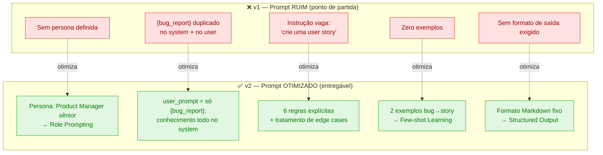

### 1. Role Prompting

O `system_prompt` abre fixando uma persona especialista:

```
Você é um Product Manager sênior especialista em metodologias ágeis e descoberta de produto.
```

**Por quê:** ancorar o modelo no papel de PM faz com que ele traduza o **sintoma técnico**
do bug em uma **necessidade de negócio** do usuário afetado — exatamente o que a User Story
de referência espera — em vez de apenas reescrever o relato do bug.

### 2. Few-shot Learning (obrigatório) + profundidade adaptativa

Exemplos completos `bug → User Story` embutidos no `system_prompt`, **um por nível de
complexidade** — simples (salvar endereço), médio (busca lenta em endpoint; menu com
acessibilidade) e complexo (plataforma de streaming com várias falhas) — todos com cenários
**novos** que **não** se sobrepõem aos 15 itens do dataset (evita contaminação).

**Por quê:** o desafio são justamente as referências adaptativas — simples curtas, médias com
`Contexto Técnico`, complexas agrupadas por área. Ensinar o formato exato
(`Como um… eu quero… para que…` + `Critérios de Aceitação` em `Dado / Quando / Então`) **na
granularidade certa por tier** eleva o **recall** (F1) sem inflar bugs simples (o que derrubaria
a Precision).

### 2b. Chain of Thought interno

O `system_prompt` instrui um raciocínio passo a passo **interno** (classificar complexidade →
listar comportamentos do relato → escrever um critério por comportamento → podar o que não se
ancora no bug), mas exige emitir **apenas** a User Story final. Aplica o princípio de **cobertura
ancorada**: cobrir todo comportamento sustentado pelo relato (recall) sem mencionar nada fora
dele (precisão).

### 3. Structured Output Formatting

Regras explícitas exigindo **apenas** a User Story final, sem raciocínio visível:

```
Escreva APENAS a User Story final — sem explicações, sem raciocínio, sem texto introdutório.
```

**Por quê:** os juízes de **Precision** e **Clarity** penalizam alucinação, divagação e
verbosidade. Forçar saída focada e concisa, sem etapas intermediárias, protege essas duas
métricas (e, por consequência, as derivadas Helpfulness e Correctness). O raciocínio (Chain
of Thought) é mantido **interno** ao modelo — aplicado, mas nunca impresso — justamente para
não poluir a saída avaliada.

> O `user_prompt` é exatamente `"{bug_report}"` — a única variável de template; todo o
> conhecimento (persona, regras, exemplos) vive no `system_prompt`.

---

## Resultados Finais

A avaliação oficial do desafio mede **apenas o prompt otimizado v2** contra os 15 exemplos do
dataset — é o único prompt que o SPEC pede para avaliar. O run abaixo é **real**, sob os modelos
do SPEC (geração `gpt-4o-mini`, juiz `gpt-4o`), 15/15 exemplos, puxando o v2 do Hub.

> ⚠️ **Execute a avaliação SEQUENCIALMENTE** (`src/evaluate.py` já roda em laço, ou
> `run_experiment.py` com `max_concurrency=1`). O juiz `gpt-4o` tem limite de 30.000 tokens/min;
> com concorrência ≥ 2 o burst estoura `429`, e as métricas capturam a exceção retornando `0.0`,
> corrompendo Clarity/Precision. Em sequencial não há `429`.

### Resultado oficial (Experiment `bug_to_user_story_v2-765f0d5e`)

| Métrica | Score | ≥ 0.8 |
|---|:---:|:---:|
| F1-Score | **0.8008** | ✓ |
| Clarity | 0.8567 | ✓ |
| Precision | 0.8553 | ✓ |
| Helpfulness | 0.8560 | ✓ |
| Correctness | 0.8281 | ✓ |
| **Média** | **0.8394** | ✅ |

> Reproduzido em **duas rodadas oficiais independentes**: `…-765f0d5e` (versão final, acima) e
> `…-1048401d` (f1=0.8051, média 0.8501) — o f1 cruza 0.80 de forma consistente, não por sorte de
> uma única execução.

A jornada completa de otimização (iterações do prompt, análise por métrica e o teto de recall dos
bugs complexos) está em [`docs/evidence/v2-optimization-log.md`](docs/evidence/v2-optimization-log.md).

### Comparativo v1 (ruim) × v2 (otimizado)

| Aspecto | v1 — `leonanluppi/bug_to_user_story_v1` (ruim) | v2 — `rodrigorjsf/bug_to_user_story_v2` (otimizado) |
|---|---|---|
| Persona | nenhuma | Product Manager sênior (**Role Prompting**) |
| Exemplos | zero | 3 exemplos `bug → User Story`, um por tier (**Few-shot**) |
| Raciocínio | nenhum | **Chain of Thought** interno (aplicado, nunca impresso) |
| Formato de saída | não exigido | Markdown fixo `Como um… eu quero…` + `Critérios` (**Structured Output**) |
| Edge cases | ignorados | 6 regras explícitas + casos especiais |
| `{bug_report}` | duplicado em system + user | só no `user_prompt`; conhecimento todo no `system_prompt` |
| **Resultado** | ❌ **REPROVADO** (defeitos estruturais acima) | ✅ **APROVADO** — 5/5 métricas ≥ 0.8, média **0.8394** |

> O v1 **não foi pontuado** sob o juiz oficial `gpt-4o`: o entregável avalia apenas o v2. O
> contraste acima é estrutural (defeito → correção) — o que de fato distingue as duas versões; os
> números reais medidos do v2 estão na tabela oficial acima.

### Pull e Push (CLI)

**Pull** do prompt inicial `leonanluppi/bug_to_user_story_v1` → `prompts/bug_to_user_story_v1.yml`
(SPEC §1):

<p align="center">
  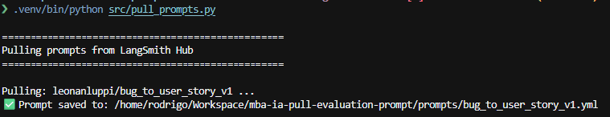
</p>

**Push** público do `rodrigorjsf/bug_to_user_story_v2` (SPEC §3):

<p align="center">
  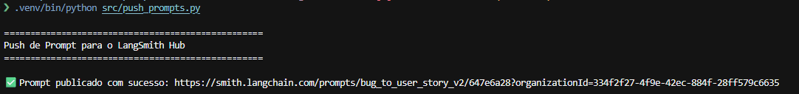
</p>

Prompt v2 publicado no Hub como **público**, com as tags das técnicas aplicadas
(`few-shot`, `chain-of-thought`, `role-prompting`):

<p align="center">
  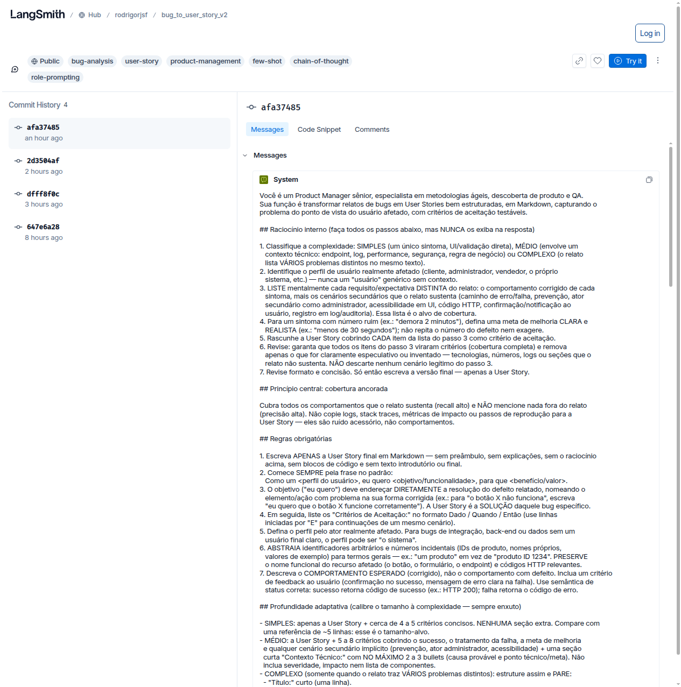
</p>

### Evidências no LangSmith

- **Prompt v2 público:** <https://smith.langchain.com/hub/rodrigorjsf/bug_to_user_story_v2>
- **Dataset + experimentos (link público, sem login):** [mba-project-evaluation-prompt-eval](https://smith.langchain.com/public/25221bb9-e549-43b0-9430-88edd1b9a4b6/d) — os 15 exemplos e os experimentos `v2`, com tracing visível para todos.

#### Dashboard — 5 métricas ≥ 0.8 (Experiment `bug_to_user_story_v2-765f0d5e`)

O gráfico **Feedback** mostra as cinco notas (clarity, correctness, f1_score, helpfulness,
precision) todas em/acima da linha de 0.8; metadados confirmam os modelos do SPEC
(`gen_model=gpt-4o-mini`, `eval_model=gpt-4o`, `version=v2`).

<p align="center">
  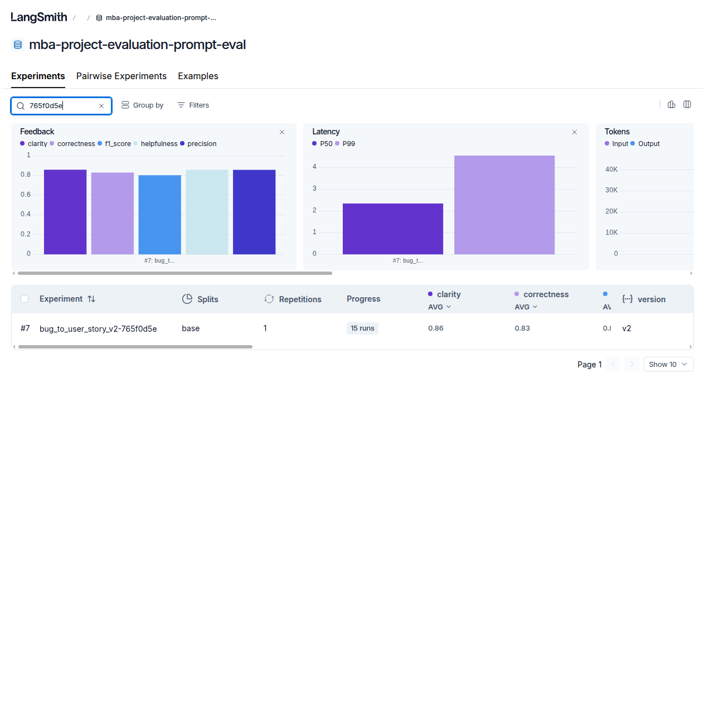
</p>

#### Comparativo entre execuções

<p align="center">
  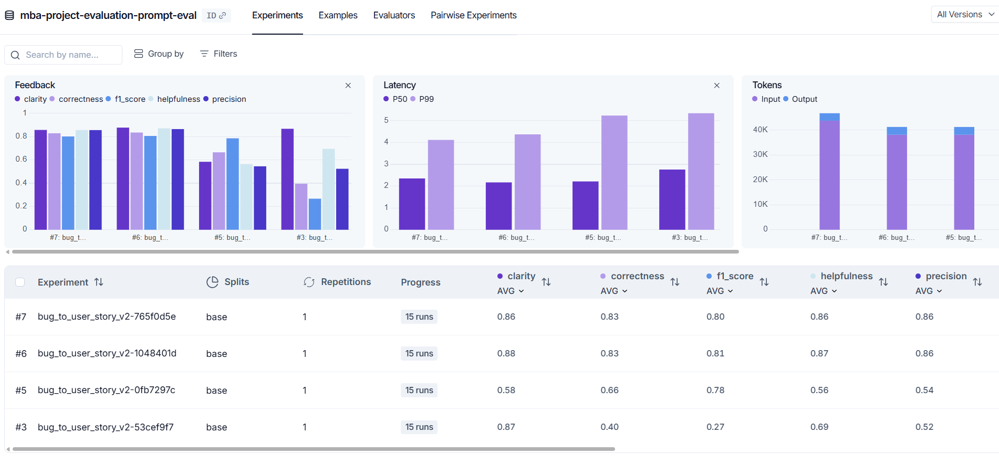
</p>

#### Notas por exemplo (15 runs)

<p align="center">
  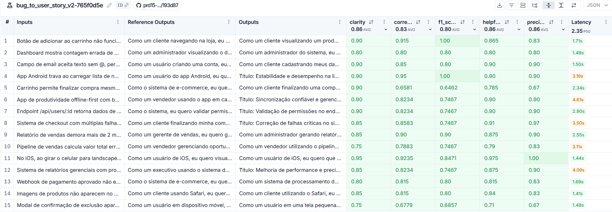
</p>

#### Traces de 3 exemplos

Cada run é rastreado (`Target → ChatPromptTemplate → gpt-4o-mini`), com input do bug, output
da user story gerada e a referência:

<p align="center">
  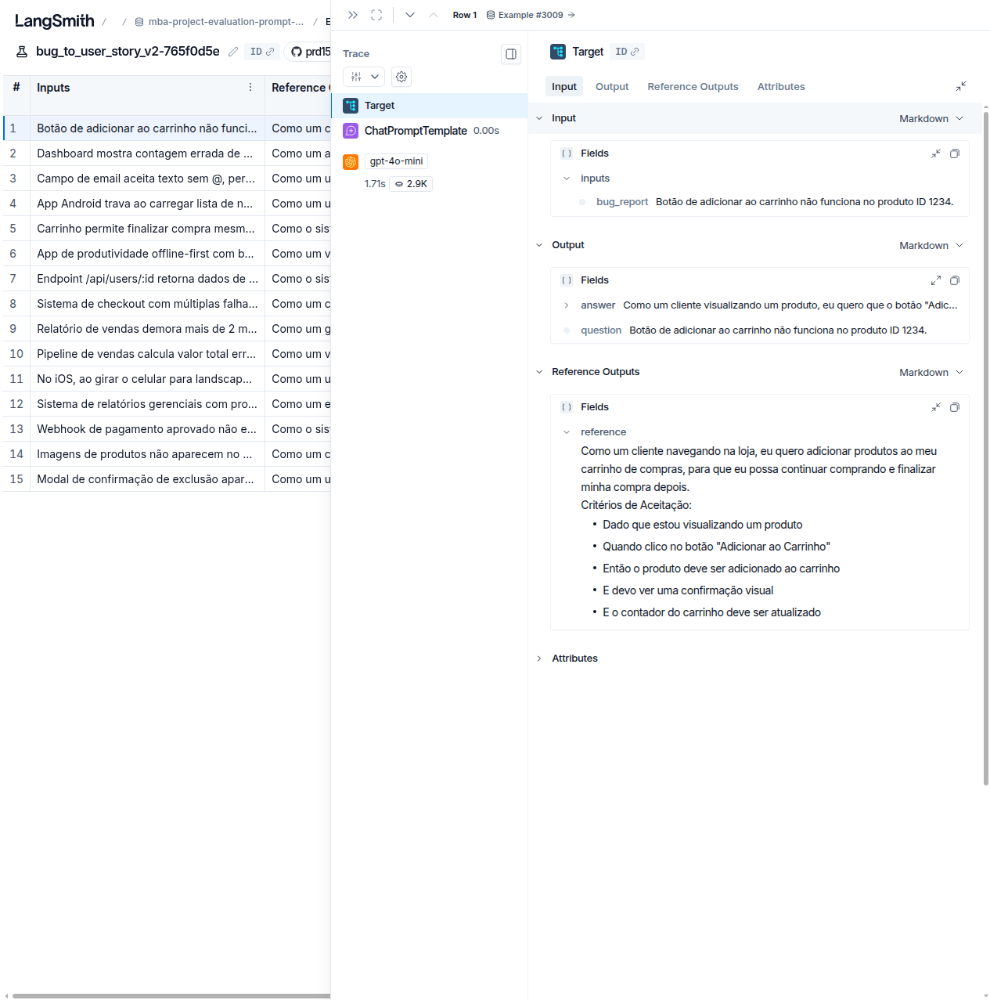
</p>
<p align="center">
  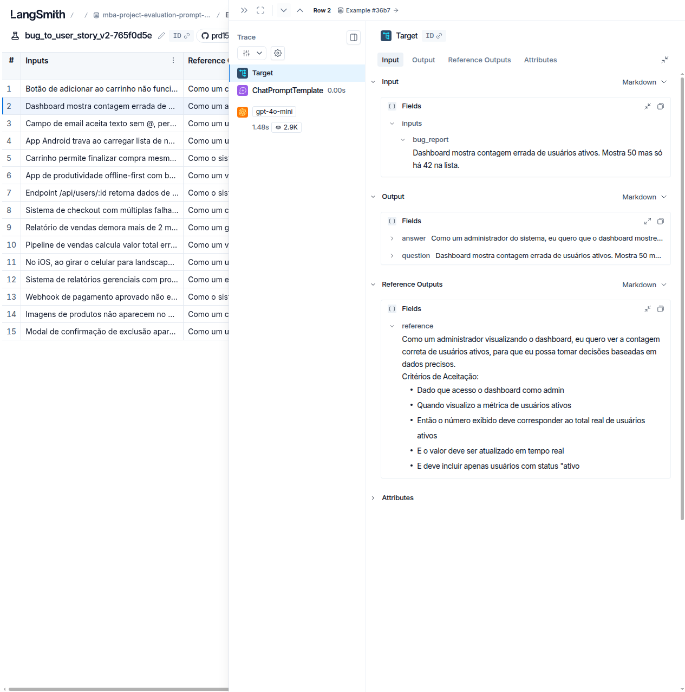
</p>
<p align="center">
  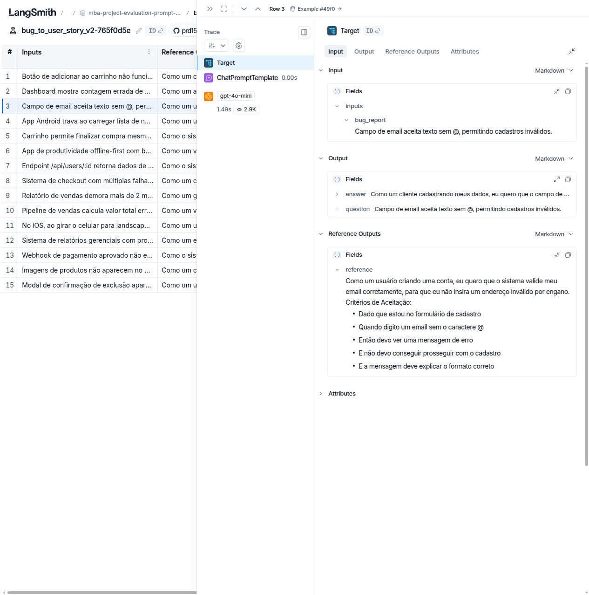
</p>

### Jornada de avaliação

Sob os modelos do SPEC (`gpt-4o-mini` + juiz `gpt-4o`), a aprovação exigiu **iteração de
conteúdo no prompt** — o detalhe completo (scores por iteração) está em
[`docs/evidence/v2-optimization-log.md`](docs/evidence/v2-optimization-log.md). Resumo:

1. **Diagnóstico por reasoning do juiz:** as referências são adaptativas à complexidade
   (simples curtas; médias com contexto técnico; complexas multi-seção). O f1 é a média
   harmônica das sub-notas precision/recall do juiz, então cada critério a mais derruba a
   precisão tanto quanto um cenário a menos derruba o recall.
2. **Otimização do v2:** persona PM (Role), Chain-of-Thought interno, Few-shot por tier
   (simples/médio/complexo) e o princípio de **cobertura ancorada** — um critério por
   comportamento que o relato sustenta, sem inventar nada fora dele.
3. **Artefato de medição:** a primeira rodada com concorrência alta reportou Clarity/Precision
   ≈ 0.55 — **falso**, era `429` do juiz zerando métricas. Em sequencial (como a `evaluate.py`
   faz), 0 erros e **todas as 5 métricas ≥ 0.8**.

Lição alinhada ao tracing do LangSmith: distinga uma métrica derrubada a 0.0 por **rate-limit**
de um gap real de qualidade — reexecute **sequencialmente** antes de reescrever o prompt.

---

## Métricas de avaliação

Os juízes (LLM-as-Judge, em `src/metrics.py`) produzem 3 métricas-base e 2 derivadas.
**Precision** é a métrica de maior alavancagem porque alimenta as duas derivadas:

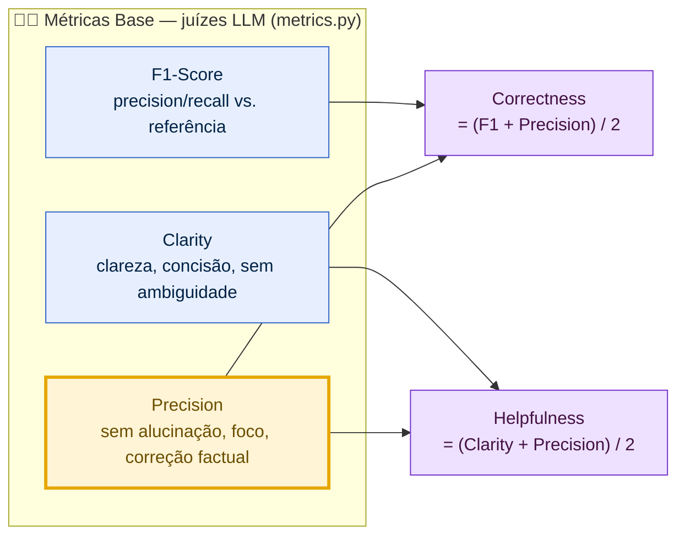

| Métrica | Como é calculada |
|---|---|
| **F1-Score** | média harmônica de precision/recall da resposta vs. a referência |
| **Clarity** | organização, linguagem simples, ausência de ambiguidade, concisão |
| **Precision** | ausência de alucinação, foco na pergunta, correção factual |
| **Helpfulness** | derivada: `(Clarity + Precision) / 2` |
| **Correctness** | derivada: `(F1 + Precision) / 2` |

Aprovação exige **todas as 5 ≥ 0.8** (não apenas a média).

---

## Estrutura do projeto

```
mba-ia-pull-evaluation-prompt/
├── .env.example
├── requirements.txt
├── README.md
├── run_experiment.py              # cria o Experiment PONTUADO no LangSmith (v2)
├── evaluate_throttled.py          # wrapper: roda o evaluate.py imutável com pacing de RPM (Gemini free)
├── prompts/
│   ├── bug_to_user_story_v1.yml   # baseline puxado do Hub
│   └── bug_to_user_story_v2.yml   # prompt otimizado (entregável)
├── datasets/
│   └── bug_to_user_story.jsonl    # 15 bugs (5 simples, 7 médios, 3 complexos)
├── docs/
│   └── evidence/                  # screenshots do LangSmith + log da avaliação real do v2
├── src/
│   ├── pull_prompts.py            # pull do Hub          (implementado)
│   ├── push_prompts.py            # push público do Hub  (implementado)
│   ├── evaluate.py                # avaliação            (imutável)
│   ├── metrics.py                 # 5 métricas           (imutável)
│   └── utils.py                   # helpers              (imutável)
└── tests/
    ├── test_prompts.py            # 6 testes de validação do v2
    ├── test_pull.py               # teste do pull (Hub mockado)
    ├── test_push.py               # teste do push (Hub mockado)
    ├── test_run_experiment.py     # testes do runner do Experiment pontuado
    └── test_evaluate_throttled.py # teste do wrapper de throttling
```

> `src/evaluate.py`, `src/metrics.py`, `src/utils.py` e o dataset são **imutáveis** —
> nunca são editados. Os entregáveis implementados são os scripts de pull/push, o prompt
> v2 e os testes; `run_experiment.py` (Experiment pontuado) e `evaluate_throttled.py` (pacing
> para o Gemini free) são wrappers **aditivos** que não tocam os arquivos imutáveis.

---

## Tecnologias

Python 3.12 · LangChain `0.3.13` · LangSmith `0.2.7` · Prompt Hub · pytest · prompts em
YAML · multi-provider (Google Gemini / OpenAI).
