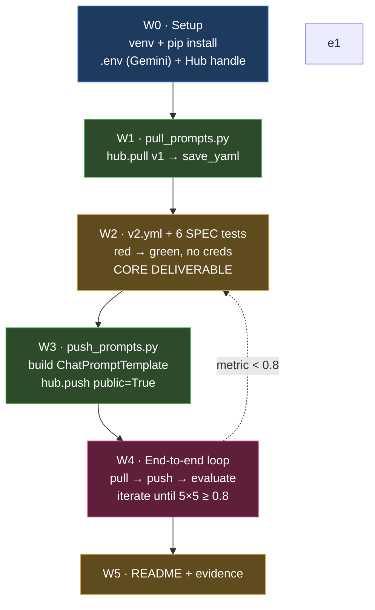
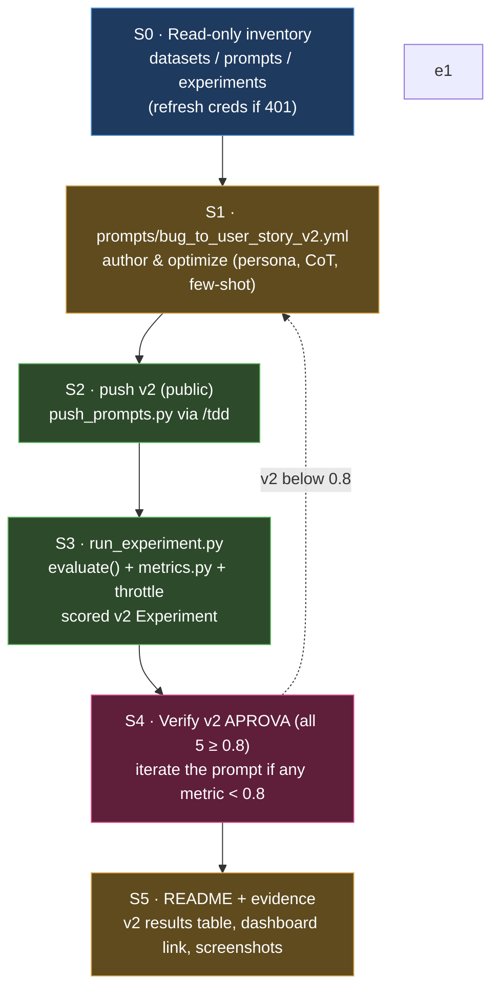

# Implementation Plan — Pull / Optimize / Evaluate Prompts

Planning output of a `grill-with-docs` session against [`docs/SPEC.md`](./SPEC.md).
Glossary: [`CONTEXT.md`](../CONTEXT.md). Decisions: [`docs/adr/`](./adr/).

## Locked decisions

| # | Decision | Rationale |
|---|----------|-----------|
| D1 | **Provider = Gemini** (`gemini-2.5-flash` for both answer and eval) | User has the Google key; free tier. |
| D2 | **Pragmatic TDD**: the 6 SPEC tests rigorously; `pull`/`push` with light mocked-`hub` unit tests | They are thin `hub` + I/O wrappers ([`CLAUDE.md`](../CLAUDE.md) mandates `/tdd` for `src/`). |
| D3 | ~~**Evidence = dataset + traces + terminal screenshot** (no native Experiment)~~ **Superseded by D9 / ADR-0003** | The deliverable does require dashboard-visible scores. |
| D4 | **`v2.yml` flat** (top-level keys, not nested under `bug_to_user_story_v2:`) | `utils.validate_prompt_structure` reads top-level `description`/`system_prompt`/`version`/`techniques_applied`. |
| D5 | **Single template var `{bug_report}`**: `system_prompt` = persona+rules+few-shot (no var), `user_prompt` = `"{bug_report}"` | `evaluate.py` calls `chain.invoke({"bug_report": ...})`; any other required var errors on all 15. |
| D6 | **Output = the User Story only** (CoT internal, no preamble) | The judged answer is compared whole against `reference`. See ADR-0002. |
| D7 | **Techniques = Few-shot + Role + CoT** (`techniques_applied` lists 3 ≥ 2) | SPEC requires Few-shot + ≥1; `test_minimum_techniques` requires ≥2 in metadata. |
| D8 | **Escape `{{ }}`** if any few-shot text contains literal braces | `ChatPromptTemplate` f-string treats `{x}` as a variable. |

**Precision is the linchpin** — it weighs into both Derived Metrics, so optimise for
factual fidelity to `reference` above all (see `CONTEXT.md`).

## Build sequence (each `src/` file via `/tdd`)

- **W0 — Setup (non-code).** `venv` + `pip install -r requirements.txt`; create `.env` from
  `.env.example` (Gemini key, `LANGSMITH_API_KEY`, `LANGSMITH_PROJECT`,
  `USERNAME_LANGSMITH_HUB`); create the Hub handle once in the LangSmith UI.
- **W1 — `pull_prompts.py`.** Red test with mocked `hub.pull` → impl: connect,
  `hub.pull("leonanluppi/bug_to_user_story_v1")`, extract system/user message templates,
  `save_yaml` to `prompts/bug_to_user_story_v1.yml`.
- **W2 — `v2.yml` + the 6 tests (core).** Write the 6 tests first (red), then author
  `v2.yml` to green. Flat schema: `description`, `system_prompt` (persona + explicit rules +
  few-shot + Markdown/User-Story format demand), `user_prompt: "{bug_report}"`,
  `version: "v2"`, `techniques_applied: [Few-shot, Role, CoT]`, `tags`, `created_at`. Must
  also satisfy `utils.validate_prompt_structure`. Runs with **no credentials**.
- **W3 — `push_prompts.py`.** Red test with mocked `hub.push` → impl: `load_yaml(v2)`,
  validate, build `ChatPromptTemplate.from_messages([("system", …), ("human", "{bug_report}")])`,
  `hub.push(f"{handle}/bug_to_user_story_v2", tmpl, new_repo_is_public=True,
  new_repo_description=…, tags=…)`. Verify the exact `hub.push` signature at implementation
  time (package not yet installed).
- **W4 — End-to-end loop.** `pull → push → evaluate`; read scores; tune `v2.yml`; repeat
  3–5×. Credentials required here.
- **W5 — README + evidence.** The final `README.md` is written **entirely in Brazilian
  Portuguese** (per user instruction — overrides the global "durable artifacts in English"
  rule for this file; it is an MBA deliverable and the SPEC is already pt-BR). Sections A
  (techniques + justification + examples), B (results: dashboard link, screenshots,
  v1-vs-v2 table), C (how to run). Capture the 15-example dataset, traces of ≥ 3 examples,
  and the ✅ terminal screenshot.

## Risks

- **Gemini 429 on a judge call → score 0.0 → fails** (it is scored as zero, not skipped).
  `evaluate.py` is immutable (no backoff) → mitigate by pacing runs and re-running.
- **`pull` overwrites the committed `v1.yml`** — confirm the regenerated format matches the
  existing artifact, or accept the regeneration.
- **`docs/ROADMAP.md` absent** while `CLAUDE.md` asks for README↔ROADMAP sync — decide in W5
  whether to add a minimal one.

## What stays untouched

`src/evaluate.py`, `src/metrics.py`, `src/utils.py`, `datasets/bug_to_user_story.jsonl` —
declared ready/immutable by the SPEC. The plan works within their contract.

---

## Slice 6 — Dashboard Experiments (scored `v2`)

Planning output of a second `grill-with-docs` session: the SPEC's "dashboard mostrando as
avaliações" was only partially met — the v2 run printed to the terminal (no scored Experiment
in the dashboard). This slice closes that gap by publishing a native, scored `v2` Experiment.
The deliverable evaluates **only `v2`**; the `v0` failing-baseline idea was abandoned (ADR-0004).

### Locked decisions

| # | Decision | Rationale |
|---|----------|-----------|
| D9 | **Native Experiment** via an additive `run_experiment.py` calling `langsmith.evaluation.evaluate()` (supersedes D3) | Only way to put scored feedback **in the dashboard** Experiments tab. See ADR-0003. |
| D10 | **Evaluate only `v2`** (the optimized prompt); no manufactured `v0` baseline | `v2` passes all five ≥ 0.8 under the rigorous judge; a synthetic failing prompt adds noise. See ADR-0004. |
| D11 | **README shows `v2` only**: the scored Experiment + the `v1 → v2` narrative (v1 = the initial pulled prompt) | The challenge evaluates only the optimized prompt; v1 is shown as the starting point, not re-run. |
| D12 | **Judge = SPEC-locked `gpt-4o`** (generation `gpt-4o-mini`), run **sequentially** | The rigorous judge is what `v2` passes under; sequential avoids the 30k-TPM 429 that zeroes metrics. |
| D13 | **Hub = one prompt**: `<handle>/bug_to_user_story_v2` (optimized), public | Single source of truth pulled by the runner; no v0 artifact to maintain. |
| D14 | **Reuse the existing eval dataset**, add the `v2` Experiment; **inventory read-only first**, no blind wipe | The old v2 "result" was traces only; the scored Experiment supersedes it. Preserves the public dataset link. |

### Build sequence (each code file via `/tdd`)

- **S0 — Inventory (non-code, read-only).** List datasets / my Hub prompts / Experiments to
  confirm what exists before adding anything. No deletes. (Partial inventory already confirmed at
  planning time: the dataset `mba-project-evaluation-prompt-eval` with 15 examples exists and the
  key authenticates.) Helper scripts run outside the repo must load `.env` by explicit path —
  `find_dotenv()` walks up from the *script* file, so a script in `/tmp` finds no `.env`.
- **S1 — `prompts/bug_to_user_story_v2.yml`.** Author and optimize the prompt (persona, internal
  CoT, per-tier few-shot, "cobertura ancorada") so it passes all five metrics ≥ 0.8. Nested
  schema loaded via `push_prompts.py`'s unwrap.
- **S2 — Push `v2` public.** `push_prompts.py` (deliverable, via `/tdd`) pushes
  `<handle>/bug_to_user_story_v2`, `new_repo_is_public=True`; the push is idempotent.
- **S3 — `run_experiment.py` (root, via `/tdd`).** `evaluate()` with the 3 Base Metrics from
  `metrics.py` as evaluators (+ derived), targets `v2` pulled from the Hub over the existing
  dataset, reuses `install_rate_limiter`, low `max_concurrency`. One scored `v2` Experiment.
- **S4 — Verify `v2` passes.** Confirm `v2` APROVA (all 5 ≥ 0.8) under the SPEC-locked
  `gpt-4o-mini` / `gpt-4o` judge, run sequentially. If any metric < 0.8, iterate the prompt
  (S1) and re-push.
- **S5 — README + evidence.** Replace the `a anexar` placeholders: the **`v2` results** table,
  the public dashboard link, and screenshots of the scored Experiment + ≥ 3 traces. Keep
  `evaluate_throttled.py` documented as the official v2 terminal pass.

### Risks

- **`v2` f1 sits below 0.8** — complex bugs have long references the generator can't fully
  reproduce, capping recall. Mitigate with "cobertura ancorada" (one acceptance criterion per
  supported behavior) and per-tier few-shot; verify each iteration sequentially (S4 loop).
- **`evaluate()` + judge 429** — the `gpt-4o` judge has a 30k-TPM cap; concurrency ≥ 2 bursts
  past it → 429 → `metrics.py` returns 0.0 and corrupts scores. Run **sequentially**
  (`max_concurrency=1`); the shared `InMemoryRateLimiter` also paces the Gemini fallback.
- **`.env` loading from helper scripts** — the credential is valid (auth confirmed at planning
  time). A planning-time 401 was a verification-script artifact: `load_dotenv()`/`find_dotenv()`
  search from the *script's* directory, so a script in `/tmp` loads no key. Real scripts run from
  the repo root (e.g. `run_experiment.py`) and authenticate fine; any throwaway diagnostic must
  pass the `.env` path explicitly or `os.chdir` to the repo root.
- **Public visibility** — each LangSmith resource (prompts, dataset, Experiments/project) must
  be shared individually for the public links to resolve.

### What stays untouched (unchanged from above)

`src/evaluate.py`, `src/metrics.py`, `src/utils.py`, `datasets/bug_to_user_story.jsonl`. The new
`run_experiment.py` is additive; `evaluate_throttled.py` remains the official v2 terminal pass.
