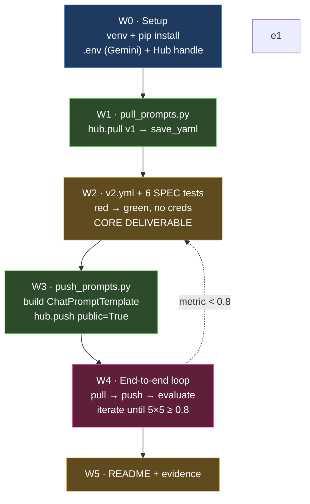

# Implementation Plan — Pull / Optimize / Evaluate Prompts

Planning output of a `grill-with-docs` session against [`docs/SPEC.md`](./SPEC.md).
Glossary: [`CONTEXT.md`](../CONTEXT.md). Decisions: [`docs/adr/`](./adr/).

## Locked decisions

| # | Decision | Rationale |
|---|----------|-----------|
| D1 | **Provider = Gemini** (`gemini-2.5-flash` for both answer and eval) | User has the Google key; free tier. |
| D2 | **Pragmatic TDD**: the 6 SPEC tests rigorously; `pull`/`push` with light mocked-`hub` unit tests | They are thin `hub` + I/O wrappers ([`CLAUDE.md`](../CLAUDE.md) mandates `/tdd` for `src/`). |
| D3 | **Evidence = dataset + traces + terminal screenshot** (no native Experiment) | `evaluate.py` is immutable and never calls `evaluate()`. See ADR-0001. |
| D4 | **`v2.yml` flat** (top-level keys, not nested under `bug_to_user_story_v2:`) | `utils.validate_prompt_structure` reads top-level `description`/`system_prompt`/`version`/`techniques_applied`. |
| D5 | **Single template var `{bug_report}`**: `system_prompt` = persona+rules+few-shot (no var), `user_prompt` = `"{bug_report}"` | `evaluate.py` calls `chain.invoke({"bug_report": ...})`; any other required var errors on all 15. |
| D6 | **Output = the User Story only** (CoT internal, no preamble) | The judged answer is compared whole against `reference`. See ADR-0002. |
| D7 | **Techniques = Few-shot + Role + CoT** (`techniques_applied` lists 3 ≥ 2) | SPEC requires Few-shot + ≥1; `test_minimum_techniques` requires ≥2 in metadata. |
| D8 | **Escape `{{ }}`** if any few-shot text contains literal braces | `ChatPromptTemplate` f-string treats `{x}` as a variable. |

**Precision is the linchpin** — it weighs into both Derived Metrics, so optimise for
factual fidelity to `reference` above all (see `CONTEXT.md`).

## Build sequence (each `src/` file via `/tdd`)

- **W0 — Setup (non-code).** `venv` + `pip install -r requirements.txt`; create `.env` from
  `.env.example` (Gemini key, `LANGSMITH_API_KEY`, `LANGSMITH_PROJECT`,
  `USERNAME_LANGSMITH_HUB`); create the Hub handle once in the LangSmith UI.
- **W1 — `pull_prompts.py`.** Red test with mocked `hub.pull` → impl: connect,
  `hub.pull("leonanluppi/bug_to_user_story_v1")`, extract system/user message templates,
  `save_yaml` to `prompts/bug_to_user_story_v1.yml`.
- **W2 — `v2.yml` + the 6 tests (core).** Write the 6 tests first (red), then author
  `v2.yml` to green. Flat schema: `description`, `system_prompt` (persona + explicit rules +
  few-shot + Markdown/User-Story format demand), `user_prompt: "{bug_report}"`,
  `version: "v2"`, `techniques_applied: [Few-shot, Role, CoT]`, `tags`, `created_at`. Must
  also satisfy `utils.validate_prompt_structure`. Runs with **no credentials**.
- **W3 — `push_prompts.py`.** Red test with mocked `hub.push` → impl: `load_yaml(v2)`,
  validate, build `ChatPromptTemplate.from_messages([("system", …), ("human", "{bug_report}")])`,
  `hub.push(f"{handle}/bug_to_user_story_v2", tmpl, new_repo_is_public=True,
  new_repo_description=…, tags=…)`. Verify the exact `hub.push` signature at implementation
  time (package not yet installed).
- **W4 — End-to-end loop.** `pull → push → evaluate`; read scores; tune `v2.yml`; repeat
  3–5×. Credentials required here.
- **W5 — README + evidence.** The final `README.md` is written **entirely in Brazilian
  Portuguese** (per user instruction — overrides the global "durable artifacts in English"
  rule for this file; it is an MBA deliverable and the SPEC is already pt-BR). Sections A
  (techniques + justification + examples), B (results: dashboard link, screenshots,
  v1-vs-v2 table), C (how to run). Capture the 15-example dataset, traces of ≥ 3 examples,
  and the ✅ terminal screenshot.

## Risks

- **Gemini 429 on a judge call → score 0.0 → fails** (it is scored as zero, not skipped).
  `evaluate.py` is immutable (no backoff) → mitigate by pacing runs and re-running.
- **`pull` overwrites the committed `v1.yml`** — confirm the regenerated format matches the
  existing artifact, or accept the regeneration.
- **`docs/ROADMAP.md` absent** while `CLAUDE.md` asks for README↔ROADMAP sync — decide in W5
  whether to add a minimal one.

## What stays untouched

`src/evaluate.py`, `src/metrics.py`, `src/utils.py`, `datasets/bug_to_user_story.jsonl` —
declared ready/immutable by the SPEC. The plan works within their contract.
